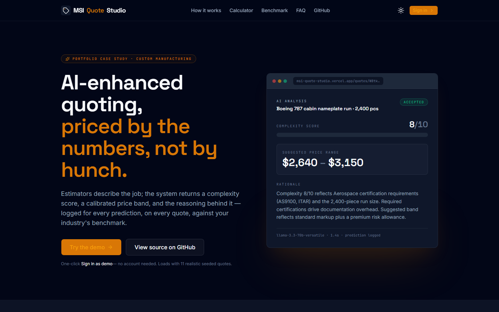
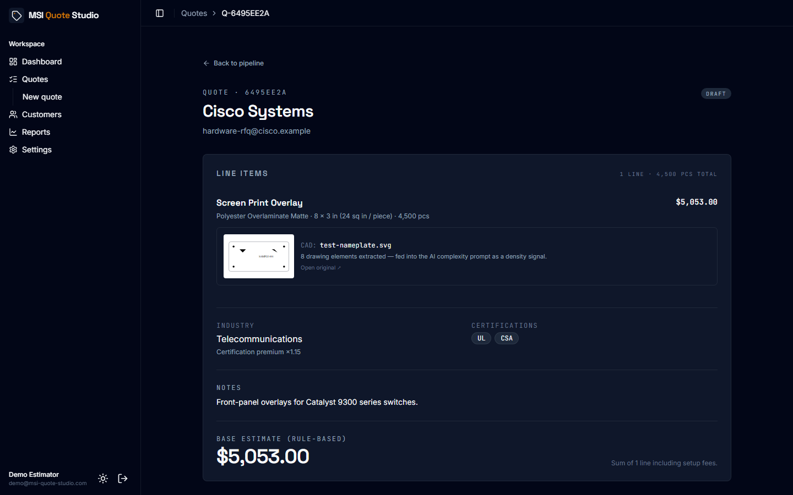
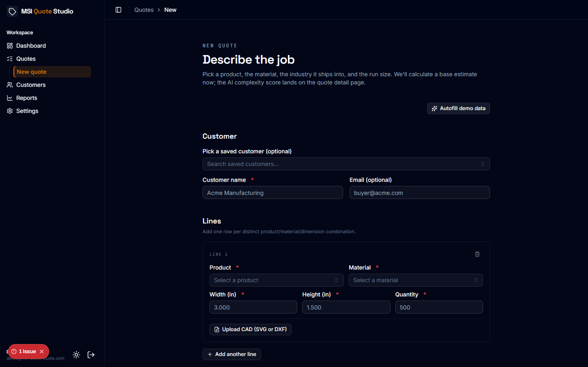
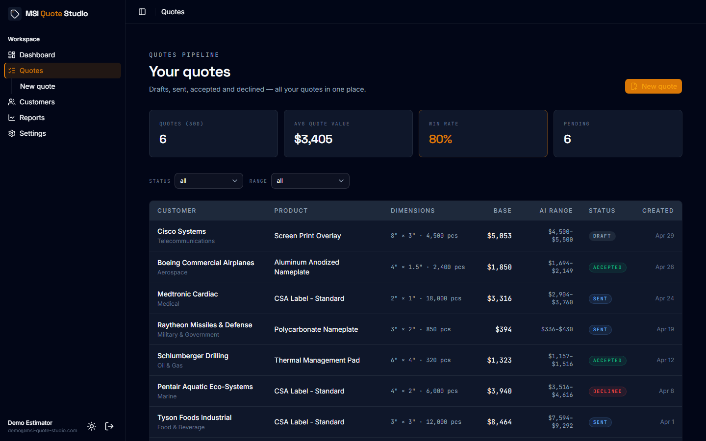
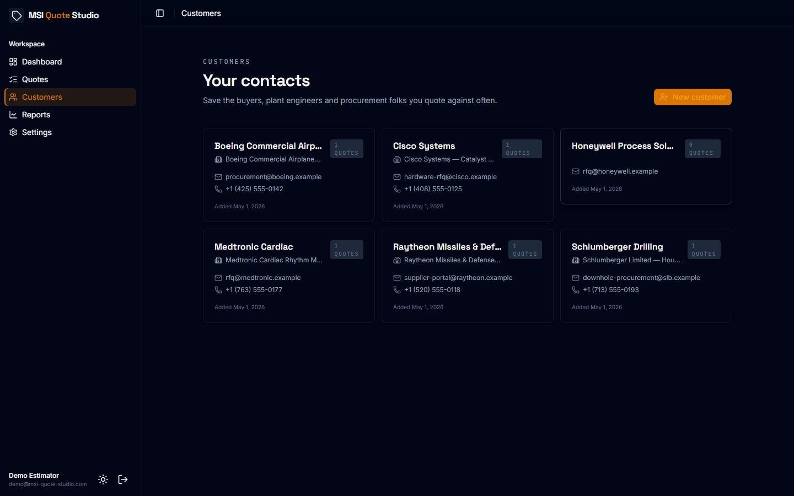
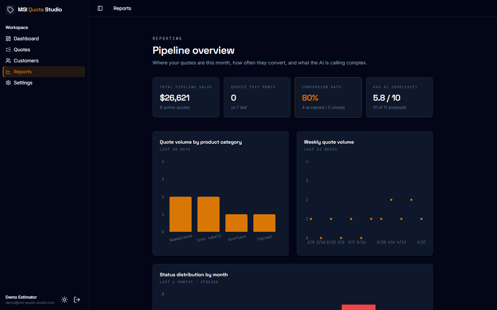
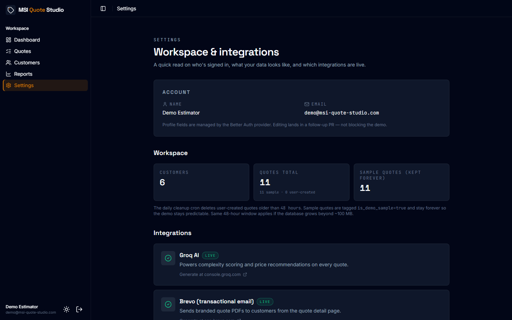
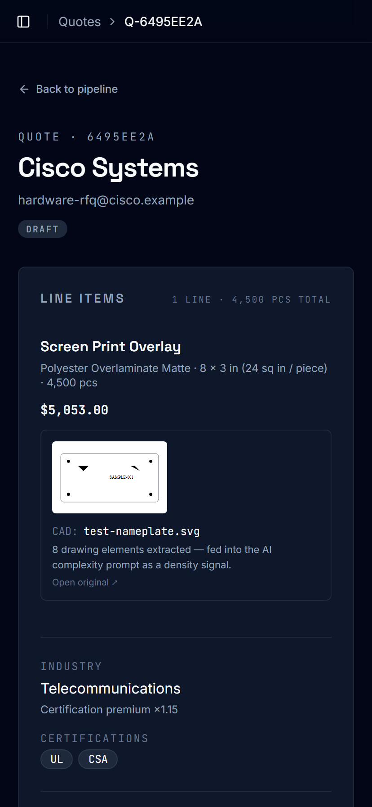

# MSI Quote Studio

> AI-enhanced quote estimator for custom manufacturing — complexity scoring, calibrated price recommendations, multi-line items, CAD upload with bounding-box extraction, branded PDF + email delivery.

**Portfolio case study by [Samuel Muriuki](https://samuel-muriuki.vercel.app/) — inspired by [Marking Systems Inc.](https://markingsystems.com/)**

🌐 **Live demo:** https://msi-quote-studio.vercel.app

---

## What this is

A working production demo of an estimating module designed around the operational reality of a durable-label and die-cut converter. Estimators describe a job (one or many lines), the system returns a complexity score (1–10), a calibrated price range, and a plain-English rationale. CAD drawings (SVG or DXF) can be uploaded per line and feed a path-count signal into the AI prompt. Every prediction is logged for audit.

The catalog (16 products, 14 materials, 8 industries with certification premiums) is seeded from publicly visible Marking Systems Inc. product categories so the demo behaves like a real estimating tool, not a sandbox.

## Demo credentials (sign-in page autofills these)

```
email:    demo@msi-quote-studio.com
password: demo-account-2026
```

The sign-in page has a **one-click "Sign in as demo →" button** that fills + submits — reviewers can land in the app in under 5 seconds. The demo account is pre-seeded with **11 realistic quotes**, **6 saved customers** (Boeing / Cisco / Medtronic / Raytheon / Schlumberger / Honeywell), and a sample CAD upload visible inline on the Cisco quote.

> **Demo data hygiene.** Anything you create through the shared demo account auto-deletes after **48 hours** via a daily Vercel cron. Curated samples are tagged `is_demo_sample=true` and stay forever so the walkthrough is always populated. Same window applies if the database grows beyond ~100 MB. Personal accounts (registered with your own email) are untouched by the cleanup.

## Screenshots

Captured at 1440 × 900 (desktop) and 414 × 896 (mobile). Save your captures into `docs/screenshots/` matching these filenames — see `docs/SCREENSHOTS.md` for the full capture guide.

### Landing



### Quote detail — the AI + CAD moment



### New quote — multi-line + persona autofill



### Quotes pipeline



### Customers (list + detail)

|  |  |
|---|---|
|  |  |

### Reports & Settings

|  |  |
|---|---|
|  |  |

### Mobile (414 × 896)



## Stack

- **Next.js 16** (App Router, Turbopack) · **React 19** · **TypeScript** strict
- **Tailwind v4** · **shadcn/ui (4)** with `@base-ui/react` primitives · **lucide-react** · **Recharts** · **next-themes**
- **Supabase Postgres** (direct SQL via `@supabase/supabase-js`, no ORM) + **Supabase Storage** for CAD uploads
- **Better Auth** (email/password + email verification) backed by `pg.Pool`
- **Groq** for AI inference (`llama-3.3-70b-versatile`, structured-JSON output, sub-second latency)
- **Brevo** for transactional email (verify, welcome, branded quote PDFs)
- **dxf-parser** for DXF bounding-box + entity-count extraction; pure-function SVG parser
- **obscenity** for server-side input moderation
- **@react-pdf/renderer** for branded quote PDFs
- **Vercel** deployment with daily cron for demo cleanup

## Features shipped

### Quoting workflow
- ✅ Multi-line items per quote — each line has its own product, material, dimensions, quantity, line estimate
- ✅ **Persona-driven autofill** — one click populates a coherent draft (Cisco → Telecom + overlay; Boeing → Aerospace + nameplate; etc.). 8 industry-matched personas
- ✅ **CAD upload (SVG + DXF)** per line — server parses bounding box + drawing-element count, offers "Use these dimensions" auto-fill, persists in private Supabase Storage
- ✅ Live base estimate preview that sums all lines under the selected industry's certification premium
- ✅ Saved-customer picker that auto-fills name + email and locks the inputs
- ✅ Server-side moderation (obscenity matcher) on customer name, email, notes

### Quote detail
- ✅ Line items list with **inline CAD preview thumbnail** (signed Supabase Storage URL)
- ✅ **AI Complexity & Pricing panel** — multi-line prompt with per-line CAD path-count hints
  - 1–10 complexity gauge with gradient fill, suggested price range, plain-English rationale
  - Categorized error states (rate-limit yellow, auth blocker, network/timeout retryable) with `Retry-After` surfacing
  - Audit row written on every inference (`ai_predictions` table)
- ✅ **Industry benchmark widget** — Materials / Labor / Overhead / Scrap bars vs the seeded industry curve, with green/red deltas
- ✅ Branded **PDF download** (`@react-pdf/renderer`, multi-line aware)
- ✅ **Email customer** dialog with the PDF attached via Brevo (auto-transitions draft → sent)
- ✅ Edit (customer info + notes; lines stay immutable to preserve AI prediction integrity)
- ✅ Status transitions with state-machine guards server-side
- ✅ 48-hour expiry pill on user-created (non-sample) rows

### Customers
- ✅ Full CRUD — list + detail + edit, with `is_demo_sample` flag preserving curated seeds
- ✅ Customer detail page with linked-quotes pipeline + 3 KPI cards (count, pipeline value, accepted value)
- ✅ Saved-customer picker on the new-quote form

### Auth + email
- ✅ One-click demo sign-in
- ✅ **Email verification on signup** — Brevo dispatches a 24-hour verify link; auto-sign-in after click
- ✅ Welcome email post-verification with deep links to /quotes/new, /customers, /reports, /settings

### Reports + settings
- ✅ Pipeline overview — total value, quotes this month, conversion rate, average AI complexity
- ✅ Quote volume by product category, weekly volume line, status-by-month stacked, top-10 pipeline table
- ✅ Settings page with workspace stats (sample vs user-created split) and **live integration status pills** for Groq, Brevo, Vercel Cron

### Polish
- ✅ Industrial Slate branding (light + dark) with `next-themes` no-flash inline script
- ✅ Sidebar collapses to icon-only on desktop, off-canvas Sheet on mobile, accent-orange active-state with edge stripe
- ✅ Auto-derived breadcrumb (`Q-XXXXXXXX` formatting on quote pages, neutral slug elsewhere)
- ✅ Brand mark (shield) inline across sidebar, landing nav, auth header
- ✅ Persona-driven autofill on customer + new-quote forms for fast demo recording
- ✅ Branded 404, error boundary, loading skeleton
- ✅ PWA manifest + viewport theme color
- ✅ Robots.txt, sitemap.xml, OpenGraph + Twitter cards

## Architecture highlights

- **Server-first.** All DB queries, Groq calls and email dispatches happen server-side. The service-role Supabase key, `GROQ_API_KEY` and `BREVO_API_KEY` never enter the browser bundle.
- **Audit log on every AI call.** Every Groq inference writes to `ai_predictions` with the prompt hash, model, latency, and complexity/price outputs.
- **Type-safe DB layer.** Supabase's generated `Database` type powers `TablesInsert`, `TablesUpdate`, etc. — no `any`s in the data path.
- **Structured AI errors.** A typed `AIError` class (codes: `rate_limit`, `auth`, `network`, `timeout`, `invalid_response`, `service_unavailable`) lets the route map every Groq failure to the right HTTP status + a friendly user message + a retryable flag.
- **State-machine guards.** Quote status transitions are validated on the server (e.g. `accepted` is terminal except for explicit re-open).
- **Atomic line-item insert.** `createQuoteAction` inserts the parent quote then bulk-inserts all lines; if the line insert fails, the parent is rolled back so the detail page never sees a quote with zero lines.
- **Per-line CAD link.** `quote_lines.cad_upload_id` lets the AI prompt join through to `cad_uploads.path_count` and surface the drawing density as a complexity signal.
- **Private storage with per-user folders.** CAD uploads live under `{user_id}/{uuid}-{filename}` in a private Supabase Storage bucket with RLS.
- **48-hour demo retention.** Vercel Cron hits `/api/cron/cleanup-demo` daily; deletes non-sample rows older than 48 h. Curated samples (`is_demo_sample = true`) stay forever.
- **No-flash theme.** `next-themes` inline script sets `html.dark` before first paint so streaming Suspense fallbacks render in the right theme.

## Getting started locally

```bash
# 1. Clone
git clone https://github.com/Samuel-Muriuki/msi-quote-studio.git
cd msi-quote-studio

# 2. Install (Node 20+, pnpm 10+)
pnpm install

# 3. Environment
cp .env.example .env.local
#   Fill in:
#     DATABASE_URL, NEXT_PUBLIC_SUPABASE_*, SUPABASE_SERVICE_ROLE_KEY
#     BETTER_AUTH_SECRET, BETTER_AUTH_URL, NEXT_PUBLIC_APP_URL
#     GROQ_API_KEY
#     BREVO_API_KEY, BREVO_SENDER_EMAIL, BREVO_SENDER_NAME (optional — email gates on these)
#     CRON_SECRET (optional — only for the daily cleanup route)

# 4. Apply migrations to your Supabase project
#   Either via the Supabase dashboard SQL editor (paste each migration in order)
#   or `supabase db push` if you have the Supabase CLI linked.

# 5. Develop
pnpm dev
#   → http://localhost:3000

# 6. (One-time) Seed the demo account + sample quotes
pnpm exec tsx --env-file=.env.local scripts/seed-demo-user.ts
pnpm exec tsx --env-file=.env.local scripts/seed-demo-quotes.ts
```

## Project structure

```
.ai/docs/                ← project brief, brand decision, Loom script (committed reference)
docs/                    ← SCREENSHOTS guide + screenshots/
supabase/migrations/     ← 0001…0009 schema + storage bucket + indexes
src/
├── app/
│   ├── (auth)/          ← sign-in, sign-up
│   ├── (app)/           ← dashboard, /quotes, /quotes/new, /quotes/[id], /quotes/[id]/edit,
│   │                       /customers, /customers/[id], /customers/[id]/edit,
│   │                       /reports, /settings
│   └── api/
│       ├── auth/[...all]/        ← Better Auth catch-all handler
│       ├── cron/cleanup-demo/    ← Vercel Cron daily sweeper
│       └── quotes/[id]/{analyze,pdf}/  ← Groq inference + branded PDF download
├── components/          ← shadcn/ui primitives + brand-mark, app-sidebar, app-breadcrumb,
│                           demo-expiry-badge, searchable-select, theme-toggle, etc.
└── lib/                 ← auth, brevo, dxf-parse, svg-parse, demo-fill, groq, estimator,
                            moderation, quote-helpers, quote-pdf-render, supabase clients,
                            verify-email, welcome-email
scripts/
├── seed-demo-user.ts        ← idempotent demo estimator account
└── seed-demo-quotes.ts      ← idempotent 11-quote seed (tagged is_demo_sample=true)
```

## Disclaimer

This is an independent portfolio project, inspired by Marking Systems Inc.'s public product catalog. It is not built for or endorsed by Marking Systems Inc., and is not a commercial offering. The branding ("Industrial Slate") is deliberately distinct from the company's actual brand. Product category names are referenced descriptively for catalog seeding only.

## Author

**Samuel Muriuki** — [sammkimberly@gmail.com](mailto:sammkimberly@gmail.com) — [portfolio](https://samuel-muriuki.vercel.app/)
